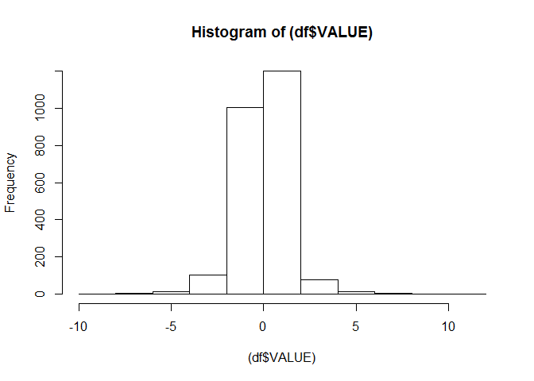
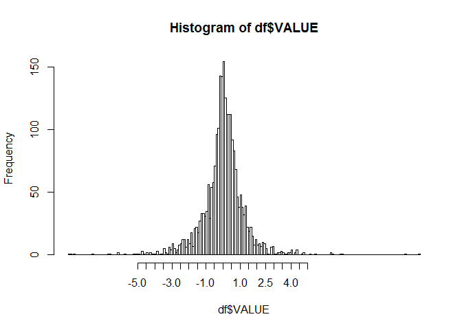
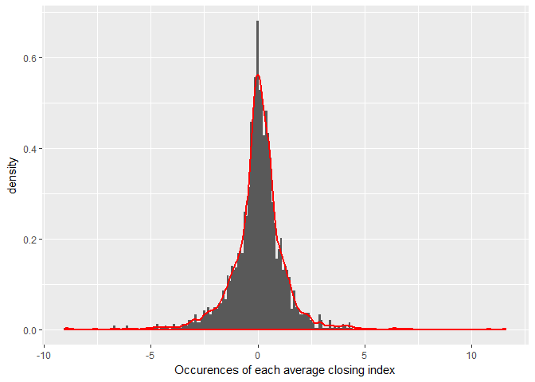

# S&P 500 Readme


## Problem description

The change of S&P 500 is defined as the percentage of index change compared to the previous closing index. For example, yesterday's S&P 500 is at 1000 when stock closed; today's S&P 500 is at 1002 when stock closed; in this case, the change of S&P 500 today is 2%.

Application: A Spark application in  Scala to find a range [-x%, x%], so that the probability of "the change of S&P falls in this range" is around 90% statistically. For example, if 90% of the S&P change falls in the range of [-5%, 5%], your application should output 5% as the result.

Input data: the daily percent of change in closing index for the last 10 years.


<!-- -->

```
## [1] 2419
```

<!-- -->

## Density plot

Density of average change appears normally distributed. Area under the density curve would give us the set of symmetrical ranges where 90% of changes fall.

<!-- -->

Ideally we would use the Kernel Estimation for Cumulative Distribution Function, using as input the x-values from the density curve above. In scala, there is the KernelDensity object, which gives probabilities at a particular x-value, or KernelEstimator, which gives a cumulative estimate. In this case the latter would be better. However,due to time constraints, it wasn't possible to write and test a function calculating the area under the density curve (above) between 2 points using KernelEstimator, so instead we are using the density of the known points, provided in the 10-year data, and using the KernelEstimator class. This introduces error since it only provides around 80% of the total density. 

