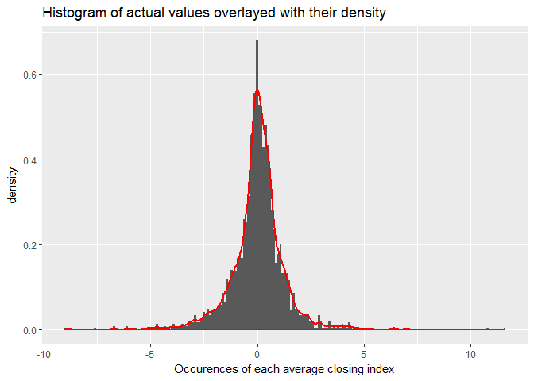

# S&P 500 Readme

## Problem description

The change of S&P 500 is defined as the percentage of index change compared to the previous closing index. For example, yesterday's S&P 500 is at 1000 when stock closed; today's S&P 500 is at 1002 when stock closed; in this case, the change of S&P 500 today is 2%.

Application: A Spark application in  Scala to find a range [-x%, x%], so that the probability of "the change of S&P falls in this range" is around 90% statistically. For example, if 90% of the S&P change falls in the range of [-5%, 5%], your application should output 5% as the result.

Input data: the daily percent of change in closing index for the last 10 years.

## Data cleansing
Since dataset is small, import data into a dataframe to allow manipulation (removing values), then copy to an RDD. 

1) Remove any rows with nulls
2) Remove dates 
3) round values to 2 decimals
4) Sort values to make calculation of density function easier. 

## Analysis: Density plots

2 options were considered for implementing the density calculation, using as input the x-values from the dataset. Below is the histogram of the closing values, overlayed with their density.

Ideally we want the area under the curve below.
<!-- -->
Options for finding the density:
1) CDF / PDF of normal distribution, since histpram appears normally distributed.  
2) Kernel Estimation for Cumulative Distribution Function

## 1 Normal Distribution over density plot

Since the sample is approximately normal and large (>2000 elements), we could assume the population is also normally distributed and use the density of the normal distribution. 

Below is the normal curve for the mean and standard deviation of this dataset. We can see it appears much lower than the graph above for values near the mean.

<!-- -->

## 2 Kernel Estimation for Cumulative Distribution Function
This appears to give the best estimate.
<!-- -->

## Solution

Ideally we would use the Kernel Estimation for Cumulative Distribution Function. We could do this using the KernelDensity class, which gives probabilities at a particular x-value. Alternatively we could do this using scala's KernelEstimator object, which gives a cumulative estimate at a particular x-value.

In this case the first option would be better. However,due to time constraints, it wasn't possible to write and test a function calculating the area under the density curve (above) between 2 points using KernelDensityEstimator, so instead we are using the density of the known points, provided in the 10-year data, and using the KernelEstimator class. This introduces error since it only provides around 80% of the total probability. 

## Next Steps

1) Code should be re-written in more functional, less procedural style, to eliminate inefficiencies of iterating over datasets multiple times. 
2) Densities and values should be stored in a more efficient data structure (Map of key-value pairs). Current version uses an Array.
3) Density calculation should be returned as a function that's implemented differently for each of the estimation methods (normal, KernelDensity and KernelEstimator).
4) More analysis to determine which of the 3 density calculations is more appropriate for this dataset.
